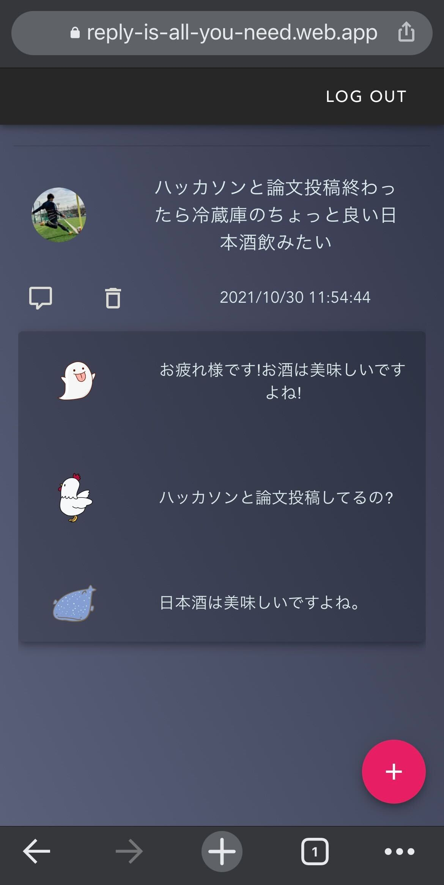

# Reply Is All You Need

## 製品概要
### 背景(製品開発のきっかけ、課題等）　
「昨日アイデアが出たと思ったのに、人と話す機会がなくて忘れてしまった！」 
こんなことありませんか？

Reply Is All You Needは、ふと湧いて出たアイデアを

- 人に話すまでには忘れてしまう
- 人に話すまでに熱が冷めてしまう
- わざわざ人に聞いてもらうまでもない

そんな人のためのメモアプリです。

### 製品説明（具体的な製品の説明）
### 特長
#### **特長1: メモに対して複数の仮想人格からフィードバックが得られる**
アプリに対して仮想的な相手から意見や感想のフィードバックが返ってきます。
「それ良いね」というような肯定的な意見や具体的な内容に関する意見、SNS独特の意見まで幅広い意見をもらえます。
相手は現実の人間ではないので、どんなことでも気兼ねなくメモできます。

#### **特長2: SNS風のインターフェース**
単に文字を打ち込むだけの味気ないメモ帳ではなく、SNS風のインターフェースにメモを残せるので孤独なメモ作業から解放されます。
本当のSNSのように反応があるので、思ったことをすぐメモする習慣がつきます。

#### **特長3: 意見の生成にはTransformerモデルを利用**
意見の生成には人間と遜色ないブログ記事を生成して話題になったGPT-3やGithub Copilotにも使われているTransformer構造を採用しました。
約200万件のツイッターデータをもとにした意見が生成されます。

### 解決出来ること
- 単なる思いつきも、仮想の人格との対話でより深まったアイデアになります。
- 普段のメモアプリが味気なくて開くのが億劫になってしまう人もすぐにメモに残せるようになります。

### 今後の展望
* 意見生成のモデル数を増やし、より多様な個別の人からのフィードバックを可能に
* 意見を返す人格を選べるように
  * 「この人の意見を聞いてみたい」を可能に
* より長い議論ができるように

### 注力したこと（こだわり等）
* メモアプリのインターフェースをSNS風にしたため、意見生成にはTwitterデータを基にした深層学習モデルを利用
* 口調が特徴的なツイートを一部学習に用いたのだ

## 開発技術
### 活用した技術
#### API・データ
* Twitterから取得した約200万件のツイート・リプライ連鎖データ
* アライグマコーパス
  * 「なのだ」口調が特徴的な3万件のツイート・リプライ連鎖データなのだ

#### フレームワーク・ライブラリ・モジュール
* Docker
* FastAPI
* PyTorch
* Transformers
* Vue
* TypeScript
* JavaScript

#### デバイス
* Chrome(Android, iOS, PC)

### 独自技術
#### ハッカソンで開発した独自機能・技術
* 最先端の深層学習モデル(T5, BART; Transformer)を利用した意見生成: [ファイルリンク](https://github.com/jphacks/C_2108_1/)
  * 1週間での開発であったため, 事前に大規模な学習がされた機械学習モデルを利用
  * T5モデルは意見生成時に似たような文章が出ないように機械学習モデル内部で工夫
  * BARTモデルは特徴的なキャラクターを演出するために一般的な対話を学習してから口調を固定する学習を行ったのだ

#### 製品に取り入れた研究内容（データ・ソフトウェアなど）（※アカデミック部門の場合のみ提出必須）
* 清水 健吾, 藤倉 将平, 菊池 英明: "Encoder-Decoder モデルによる一人称単語を用いた自己開示発話の生成", 言語処理学会 第26回年次大会 発表論文集, pp.241-242, 2020. [論文リンク](https://www.anlp.jp/proceedings/annual_meeting/2020/pdf_dir/P2-25.pdf)
* 上垣 貴嗣, 藤倉 将平, 菊池 英明: "非タスク指向対話システムにおける攻撃的ユーモア発話の生成", 言語処理学会 第26回年次大会 発表論文集, pp.871-872, 2020. [論文リンク](https://www.anlp.jp/proceedings/annual_meeting/2020/pdf_dir/P4-22.pdf)
